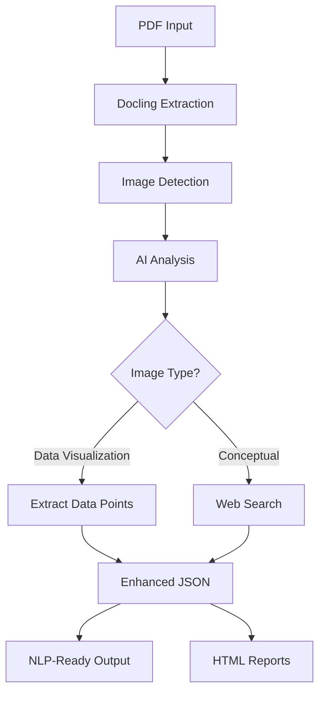

# 📄 PDF Image Analyzer

> **A comprehensive AI-powered PDF analysis system that extracts, analyzes, and enhances PDF documents with intelligent image recognition and web search capabilities.**


## 🌟 Overview

PDF Image Analyzer is a cutting-edge solution that transforms static PDF documents into intelligent, searchable content. By combining advanced document processing with state-of-the-art AI vision models, it extracts images, analyzes their content, and enhances them with contextual information from web searches.

### 🔧 What's New

- New modular `Functions/` package with clean, testable functions:
  - PDF→JSON (`pdf_to_json.py`)
  - Image analysis, web search, and enrichment (`image_analysis.py`)
  - DePlot chart extraction with robust parser (`chart_extraction.py`)
  - Two-step processing pipeline (`pipeline_steps.py`)
  - Final JSON verification (no file output, returns structured results) (`verification.py`)
  - Simple logging setup (`utils_logging.py`)
- Reproducible two-stage notebook `Reproduce_Two_Stages.ipynb` to separately run:
  1) PDF→JSON; 2) JSON→Enhanced→NLP-ready + inline verification
- Headless DePlot debug tester `Functions/debug_deplot_test.py` (prints structure only)

### ✨ Key Features

- 🔍 **Smart PDF Processing** - Extract text and images using Docling with VLM pipeline
- 🤖 **Multi-AI Provider Support** - Compatible with OpenAI, Google Gemini, Anthropic Claude, and LM Studio
- 🌐 **Web Search Integration** - Automatic contextual enhancement with DuckDuckGo and native search APIs
- 📊 **Interactive Reports** - Generate comprehensive HTML evaluation reports
- 🐳 **Production Ready** - Docker containerization for scalable deployment
- 🖥️ **User-Friendly GUI** - Streamlit web interface for easy interaction
- 📈 **Research Tools** - Specialized notebooks for chart data extraction and analysis

## 🚀 Quick Start

### Option 1: One-Click Docker Deployment (Recommended)

**Windows Users:**
```bash
# Download and run the latest release
curl -O https://github.com/yourusername/yourrepo/releases/latest/download/quick-start-windows.bat
./quick-start-windows.bat
```

**Linux/macOS Users:**
```bash
# Download and run the latest release
curl -O https://github.com/yourusername/yourrepo/releases/latest/download/quick-start-linux.sh
chmod +x quick-start-linux.sh
./quick-start-linux.sh
```

### Option 2: Streamlit GUI Application

```bash
# Clone the repository
git clone https://github.com/yourusername/yourrepo.git
cd yourrepo/PDF_Analyzer_App

# Install dependencies
pip install -r requirements.txt

# Run the application
streamlit run app.py
```

## 📦 Installation Options

### 🐳 Docker Deployment (Production)

Perfect for server environments, CI/CD pipelines, and production use cases.

**Prerequisites:**
- Docker Desktop installed
- NVIDIA GPU with 8GB+ VRAM (recommended)
- 16GB+ RAM
- 50GB+ free disk space

**Quick Setup:**
```bash
cd docker_deployment
./deploy.bat  # Windows
./deploy.sh   # Linux/macOS
```

**Features:**
- ✅ Headless operation (no GUI required)
- ✅ GPU acceleration support
- ✅ SmolDocling VLM pipeline
- ✅ Automated dependency management
- ✅ Volume mounting for input/output
- ✅ Production-optimized logging

### 🖥️ GUI Application (Development & Interactive Use)

Ideal for researchers, analysts, and interactive document processing.

**Prerequisites:**
- Python 3.11+
- AI provider API keys (OpenAI, Gemini, Claude) OR LM Studio

**Setup:**
```bash
# Navigate to GUI application
cd PDF_Analyzer_App

# Install dependencies
pip install -r requirements.txt

# Configure AI provider (choose one):
# - Set API keys in sidebar for cloud providers
# - Install and run LM Studio for local processing

# Launch application
streamlit run app.py
```

**Features:**
- ✅ Interactive web interface
- ✅ Real-time processing monitoring
- ✅ Multiple AI provider support
- ✅ Batch processing capabilities
- ✅ Interactive evaluation reports
- ✅ Advanced filtering and sorting

## 🛠️ AI Provider Configuration

### Cloud Providers (Recommended)

| Provider | Features | Setup |
|----------|----------|--------|
| **Google Gemini** | Native web search, latest models | Set `GOOGLE_API_KEY` |
| **OpenAI GPT** | GPT-4o, web browsing* | Set `OPENAI_API_KEY` |
| **Anthropic Claude** | Advanced reasoning | Set `ANTHROPIC_API_KEY` |

### Local Processing

| Provider | Features | Setup |
|----------|----------|--------|
| **LM Studio** | Privacy, offline | Install LM Studio + vision model |

*Web browsing availability varies by model and account type

## 📊 Processing Workflow



### Step-by-Step Process

1. **📄 Document Processing** - Extract text and images using Docling VLM pipeline
2. **🔍 Image Analysis** - Classify images as informative vs. non-informative
3. **🤖 AI Enhancement** - Generate detailed descriptions using vision models
4. **🌐 Web Context** - Add relevant background information via web search
5. **📊 Report Generation** - Create interactive HTML evaluation reports
6. **💾 Output Creation** - Generate multiple output formats for different use cases

## 📁 Project Structure

```
PDF-Image-Analyzer/
├── 🖥️ PDF_Analyzer_App/           # Streamlit GUI Application
│   ├── app.py                     # Main application entry point
│   ├── pdf_processor.py           # PDF to JSON conversion
│   ├── image_analyzer.py          # AI image analysis
│   ├── api_manager.py            # Multi-provider AI interface
│   ├── html_report_generator.py  # Report generation
│   └── output/                   # Processing results
│
├── 🧩 Functions/                 # Modular function package (new)
│   ├── pdf_to_json.py            # LM Studio + Docling PDF→JSON
│   ├── image_analysis.py         # Image analysis + web search + enrichment
│   ├── chart_extraction.py       # DePlot extraction + robust parser
│   ├── pipeline_steps.py         # Step1 (enhance) + Step2 (NLP-ready)
│   ├── verification.py           # Final JSON validator (returns dict)
│   ├── utils_logging.py          # Logging setup
│   └── debug_deplot_test.py      # Headless DePlot tester
│
├── 🐳 docker_deployment/          # Production Docker Setup
│   ├── main.py                   # Containerized processing engine
│   ├── Dockerfile                # Container configuration
│   ├── deploy.sh/.bat           # Automated deployment
│   ├── quick-start-*.sh/.bat    # One-click installers
│   └── docs/                    # Deployment documentation
│
├── 📓 Research Notebooks/          # Development & Analysis Tools
│   ├── PDF_extract_and_Picture_Describe.ipynb  # Original research
│   ├── data_extract.ipynb        # Chart data extraction
│   └── json2html.ipynb          # Format conversion utilities
│
├── 📂 Sample Data/
│   ├── Sample Papers/            # Test PDF documents
│   └── Sample Line Chart/        # Chart analysis examples
│
├── Reproduce_Two_Stages.ipynb    # Reproducible 2-stage pipeline notebook (new)
│                                  # Stage 1: PDF→JSON; Stage 2: JSON→Enhanced→NLP-ready + verification
│
└── 📚 Documentation/
    ├── PROJECT_FUNCTIONS_DOCUMENTATION.md  # Complete function reference
    └── README.md                 # This file
```

## 🔧 Advanced Usage

### Batch Processing

**GUI Application:**
```python
# Upload multiple PDFs through the web interface
# Processing happens automatically with progress tracking
# Results are organized in tabs for easy navigation
```

**Docker Command Line:**
```bash
# Place PDFs in input directory
docker run --gpus all -v ./input:/app/input -v ./output:/app/output pdf-analyzer:latest

# Results appear in output directory
# Enhanced JSON, NLP-ready versions, and HTML reports generated
```

### Custom AI Provider Integration

```python
# Add new AI provider in api_manager.py
def _call_custom_provider(self, image_uri: str, prompt: str, max_tokens: int):
    # Implement custom API integration
    pass
```

### Research and Development

```python
# Chart data extraction
from data_extract import get_color_mask, find_axes_automatically

# JSON to HTML conversion
from json2html import convert_json_to_html

# Original LM Studio workflow
from PDF_extract_and_Picture_Describe import convert_pdf_with_lmstudio
```

## 📈 Output Formats

### 📊 JSON Outputs

- **`filename.json`** - Original Docling extraction with embedded images
- **`filename_enhanced.json`** - Added AI analysis and web context
- **`filename_nlp_ready.json`** - Text-only version optimized for NLP processing

### 📑 HTML Reports

- **`filename_report.html`** - Interactive image analysis report
- **`filename_complete_report.html`** - Comprehensive evaluation dashboard

### 🔍 Report Features

- Interactive image viewing with click-to-enlarge
- Web search results with source attribution
- Processing statistics and quality metrics
- Evaluation checklists for systematic assessment
- Exportable results and downloadable assets

## 🎯 Use Cases

### 📚 Academic Research
- Extract and analyze figures from research papers
- Generate searchable databases of academic content
- Create enhanced digital libraries

### 📈 Business Intelligence
- Process financial reports and presentations
- Extract insights from charts and visualizations
- Generate summaries for executive briefings

### 📄 Document Management
- Digitize and enhance document archives
- Create searchable content databases
- Automate document classification

### 🔬 Data Science
- Preprocess documents for ML pipelines
- Extract structured data from unstructured sources
- Generate training datasets for vision models

## 🤝 Contributing

We welcome contributions! Please see our contributing guidelines:

1. **Fork the repository**
2. **Create a feature branch** (`git checkout -b feature/amazing-feature`)
3. **Commit your changes** (`git commit -m 'Add amazing feature'`)
4. **Push to the branch** (`git push origin feature/amazing-feature`)
5. **Open a Pull Request**

### Development Setup

```bash
# Clone repository
git clone https://github.com/yourusername/yourrepo.git
cd yourrepo

# Install development dependencies
pip install -r PDF_Analyzer_App/requirements.txt
pip install -r docker_deployment/requirements.txt

# Install research dependencies
pip install jupyter opencv-python matplotlib

# Run tests
python -m pytest
```

## 📋 Requirements

### System Requirements

**Minimum:**
- 8GB RAM
- 20GB free disk space
- Python 3.11+
- Internet connection (for AI APIs and web search)

**Recommended:**
- 16GB+ RAM
- NVIDIA GPU with 8GB+ VRAM
- 50GB+ free disk space
- High-speed internet connection

### Software Dependencies

**Core Dependencies:**
- docling>=2.40.0 (PDF processing)
- streamlit>=1.47.1 (GUI interface)
- requests, pandas, numpy (data processing)
- Pillow (image handling)

**AI Provider SDKs:**
- openai (OpenAI GPT)
- google-genai (Google Gemini)
- anthropic (Claude)

**Optional Dependencies:**
- opencv-python (chart analysis)
- matplotlib (visualization)
- jupyter (research notebooks)

## 📜 License

This project is licensed under the MIT License - see the [LICENSE](LICENSE) file for details.

## 🙏 Acknowledgments

- **Docling Team** for the excellent PDF processing framework
- **Streamlit** for the intuitive web interface framework
- **AI Providers** (OpenAI, Google, Anthropic) for powerful vision models
- **LM Studio** for local AI processing capabilities
- **DuckDuckGo** for privacy-respecting web search

## 📞 Support

- 📧 **Issues**: [GitHub Issues](https://github.com/yourusername/yourrepo/issues)
- 📖 **Documentation**: [Function Reference](PROJECT_FUNCTIONS_DOCUMENTATION.md)
- 🐳 **Docker Guide**: [Docker Deployment](docker_deployment/README.md)
- 🔧 **Troubleshooting**: [Docker Troubleshooting](docker_deployment/TROUBLESHOOTING.md)

## 🚀 Recent Updates

### v1.0.0 - Docker Production Release
- ✅ Complete Docker containerization
- ✅ One-click deployment scripts
- ✅ Multi-platform support (Windows/Linux/macOS)
- ✅ GitHub Release automation
- ✅ Comprehensive English documentation
- ✅ Production-ready error handling

### v1.1.0 - Functions Module and Reproducible Notebook
- 🧩 Introduced `Functions/` package (clean modularization)
- 🧪 Added `Reproduce_Two_Stages.ipynb` to independently run two-stage processing
- 🔍 Added headless DePlot tester and robust parser improvements
- ✅ Integrated inline final JSON verification (no file output)

---

<div align="center">
  <strong>Transform your PDFs into intelligent, searchable content with AI-powered analysis!</strong>
  <br><br>
  ⭐ If this project helps you, please give it a star on GitHub! ⭐
</div>